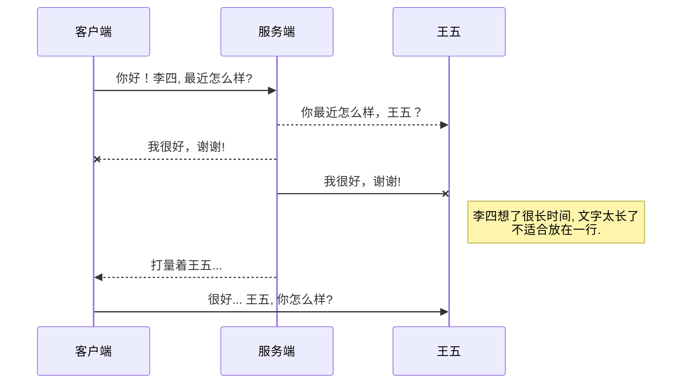

# 1、快捷键

按键        | 功能
:-----------: | :---------:
**Ctrl+X**  | 剪切
**Ctrl+F**  | 查找(Enter下一个)
**Ctrl+H**  | 替换
**Ctrl+S** |保存
**Ctrl+/** |行注释
**Shift+Alt+A** |块注释
**Ctrl+Shift+Enter** |上方插入一行
**Ctrl+Enter** |下方插入一行
**Alt+Shift+F** |格式化代码
**Ctrl+Shift+F** |文件夹查找


# 2、其他语法
## 2.1 注脚

一个具有注脚的文本。[^1]

[^1]: 注脚的解释

## 2.2 UML图



## 2.3、列表
Markdown
:  Text-to-HTML conversion tool

Authors
:  John
:  Luke

## 2.4、文本样式
*强调文本* _强调文本_

**加粗文本** __加粗文本__

==标记文本==

~~删除文本~~

> 引用文本

H~2~O is是液体。

2^10^ 运算结果是 1024。
## 2.5 代码
下面展示一些 `内联代码片`。`Tab`

```
// A code block
var foo = 'bar';
```

```javascript
// An highlighted block
var foo = 'bar';
```

Gamma公式展示 $\Gamma(n) = (n-1)!\quad\forall
n\in\mathbb N$ 是通过 Euler integral

$$
\Gamma(z) = \int_0^\infty t^{z-1}e^{-t}dt\,.
$$

